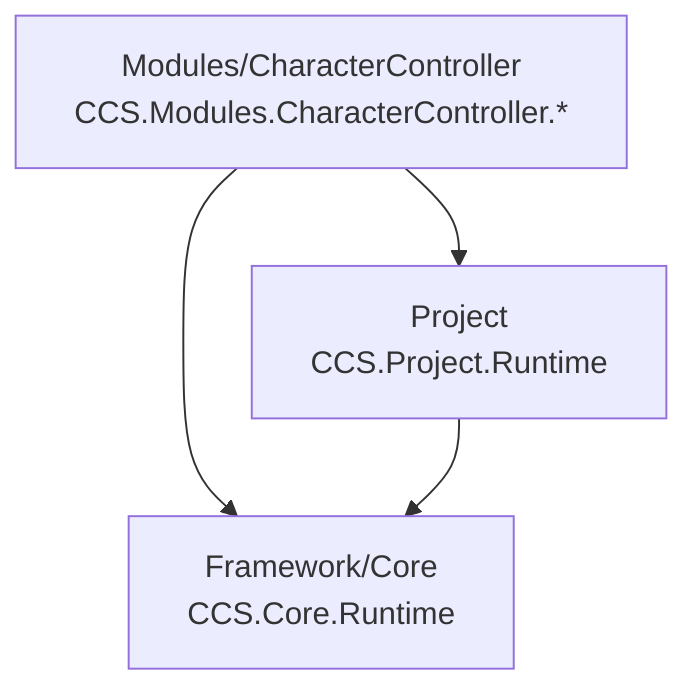

# CCS Survival — Folder Structure Reference

**Project:** CCS Survival  
**Version:** 0.2.1 — Character Controller Test Ground  
**Unity:** 6000.3.10f1 (Unity 6)  
**Author:** James Schilz  
**Date:** June 18, 2026  
**Location:** `Assets/CCS/FOLDER_STRUCTURE.md`

This is the authoritative folder inventory for the **active** CCS Unity project after the v0.2.1 cleanup. Paths are relative to the repository root unless noted.

---

## Table of Contents

1. [What Changed in v0.2.1](#what-changed-in-v021)
2. [Active Project Tree](#active-project-tree)
3. [Architecture at a Glance](#architecture-at-a-glance)
4. [Framework/](#framework)
5. [Modules/](#modules)
6. [Project/](#project)
7. [Surrounding Unity Folders](#surrounding-unity-folders)
8. [Dependency Rules](#dependency-rules)
9. [Quick Start Paths](#quick-start-paths)
10. [Related Documentation](#related-documentation)

---

## What Changed in v0.2.1

The repo was cleaned so only **actively used** content remains. No placeholder gameplay modules or empty project scaffolds.

### Removed

| Removed | Reason |
|---------|--------|
| `Assets/CCS/Modules/Crafting/` | Placeholder only — no scripts or assets |
| `Assets/CCS/Modules/Equipment/` | Placeholder only |
| `Assets/CCS/Modules/Hotbar/` | Placeholder only |
| `Assets/CCS/Modules/Interaction/` | Placeholder only |
| `Assets/CCS/Modules/Inventory/` | Placeholder only |
| `Assets/CCS/Modules/SaveSystem/` | Placeholder only |
| `Assets/CCS/Modules/UI/` | Placeholder only |
| `Assets/CCS/Shared/` | Empty scaffold — nothing referenced it |
| `Assets/CCS/Tests/` | Empty scaffold — module tests live inside modules |
| Temporary editor setup scripts | One-off asset/scene authoring menus removed |

### Kept

| Kept | Purpose |
|------|---------|
| `Assets/CCS/Framework/` | Core platform |
| `Assets/CCS/Project/` | Bootstrap, composition, docs |
| `Assets/CCS/Modules/CharacterController/` | Only active gameplay module |
| `Assets/Settings/` | Required URP / Input System settings |
| `Packages/` | Required UPM dependencies |
| `ProjectSettings/` | Unity configuration |

**Policy going forward:** Do not recreate unused module folders ahead of implementation. Add a module folder only when that feature is being built, with runtime, test asset, validation, and docs.

---

## Active Project Tree

```text
Assets/CCS/
├── FOLDER_STRUCTURE.md                 # This document
│
├── Framework/                          # Reusable core platform (gameplay-free)
│   ├── Core/
│   │   ├── Runtime/                    # CCS.Core.Runtime
│   │   ├── Editor/                     # CCS.Core.Editor
│   │   └── Documentation/
│   ├── Documentation/
│   ├── Modules/                        # Reserved: framework-level pluggable assemblies
│   ├── Shared/                         # Reserved: framework-level reusable assets
│   └── Tests/                          # Reserved: framework test assemblies
│
├── Modules/
│   ├── README.md
│   └── CharacterController/            # Only active gameplay module
│       ├── Runtime/
│       ├── Editor/
│       ├── Content/Input/
│       ├── Profiles/
│       ├── Prefabs/
│       ├── Tests/
│       │   ├── Prefabs/
│       │   ├── Materials/
│       │   └── Scenes/
│       └── Documentation/
│
└── Project/                            # Bootstrap and composition shell
    ├── Documentation/
    ├── Prefabs/
    ├── Runtime/
    └── Scenes/
```

There is **no** `Assets/CCS/Shared/` or `Assets/CCS/Tests/` at the project root anymore.

---

## Architecture at a Glance



| Rule | Detail |
|------|--------|
| Dependency direction | **Modules → Project → Core** (never reversed) |
| Module registration | Manual installer order in `CCS_SurvivalInstaller` |
| Global state | No singleton managers or static service locators |
| New modules | Must ship runtime, test asset, validation, and docs before moving on |
| Placeholders | Do not keep empty module folders for future features |

---

## Framework/

Reusable Crazy Carrot Studios platform code. Contains **no** survival-specific gameplay logic.

```text
Assets/CCS/Framework/
├── Core/           # Authoritative foundation
├── Documentation/  # Framework-wide script standards
├── Modules/        # Reserved (not the same as Assets/CCS/Modules/)
├── Shared/         # Reserved framework-level assets
└── Tests/          # Reserved framework test assemblies
```

> **Note:** `Framework/Shared/` and `Framework/Tests/` are upstream template scaffolds. They are **not** the removed project-level `Assets/CCS/Shared/` or `Assets/CCS/Tests/`.

### Core/Runtime — `CCS.Core.Runtime.asmdef`

| Subfolder | Purpose | Key contents |
|-----------|---------|--------------|
| `Data/` | Shared data types | `CCS_Result`, `CCS_Message`, error codes |
| `Diagnostics/` | Diagnostic report structs | Module, service, update-loop info |
| `Modules/` | Module lifecycle | Registry, host, install plan, base classes |
| `Services/` | Service registry | `CCS_ServiceRegistry`, `CCS_IService` |
| `Systems/` | Core systems | Bootstrap runner, events, runtime host, update loop |
| `SmokeTests/` | In-assembly smoke harness | Test modules, installers, bridge |
| `Utilities/` | Shared utilities | Logging, validation helpers |
| `Prefabs/` | Core prefabs | `PF_CCS_RuntimeHost.prefab` |
| `Scenes/` | Core validation scene | `SCN_CCS_Bootstrap.unity` |

**Key runtime types:**
- `CCS_RuntimeHost` — instance-owned subsystem host
- `CCS_ModuleRegistry` / `CCS_ModuleHost` — module lifecycle
- `CCS_ServiceRegistry` — typed services (no globals)
- `CCS_EventDispatcher` — decoupled event bus
- `CCS_BootstrapRunner` — ordered bootstrap execution

### Core/Editor — `CCS.Core.Editor.asmdef`

| Subfolder | State |
|-----------|-------|
| `Assembly/` | Reserved |
| `Inspectors/` | Placeholder (`.gitkeep`) |
| `Menus/` | Reserved |
| `Utilities/` | Placeholder (`.gitkeep`) |
| `Validators/` | Reserved |
| `Windows/` | Placeholder (`.gitkeep`) |

### Core/Documentation/

Platform architecture, upstream workflow, GitHub template setup, release notes, and validation records.

---

## Modules/

Only **CharacterController** exists as an active gameplay module.

See [Modules/README.md](Modules/README.md) for module creation rules.

### Standard layout (use when adding future modules)

```text
Assets/CCS/Modules/<Feature>/
├── Runtime/          # CCS.Modules.<Feature>.Runtime.asmdef
├── Editor/           # Validation and authoring tools
├── Content/          # Module-owned data
├── Prefabs/          # Module test prefabs
├── Profiles/         # ScriptableObject configuration
├── Tests/            # Module test scenes and harness assets
└── Documentation/    # Module contract and integration notes
```

---

### CharacterController/ — active (v0.2.1)

**Assembly:** `CCS.Modules.CharacterController.Runtime` / `.Editor`  
**Namespace:** `CCS.Modules.CharacterController`

#### Runtime/

| Subfolder | Scripts | Purpose |
|-----------|---------|---------|
| `Components/` | 4 | Motor, camera, input provider, debug HUD |
| `Services/` | 1 | `CCS_CharacterControllerService` |
| `Profiles/` | 3 | Movement/camera ScriptableObject types |
| `Data/` | 4 | State, snapshot, mode enums |
| `Validation/` | 1 | Runtime asset/prefab validation |
| *(root)* | 1 | `CCS_CharacterControllerConstants.cs` |

**Key components:**
- `CCS_CharacterMotor` — profile-driven movement
- `CCS_CharacterCameraController` — Cinemachine third-person camera
- `CCS_CharacterInputActionProvider` — Input System binding
- `CCS_CharacterControllerDebugHud` — OnGUI dev HUD (test prefab only)

#### Editor/

Long-term validation only. **No setup/menu authoring scripts.**

| Script | Purpose |
|--------|---------|
| `Validation/CCS_CharacterControllerValidationValidator.cs` | Full validation orchestration |
| `Validation/CCS_CharacterControllerValidationRegistration.cs` | Menu registration |
| `Validation/CCS_CharacterControllerTestSceneValidationUtility.cs` | Test ground prefab/scene validation |

**Menu:** `CCS/Modules/Character Controller/Validate`

#### Content/Input/

| Asset | Purpose |
|-------|---------|
| `CCS_CharacterController_InputActions.inputactions` | Module-owned Gameplay input map |

#### Profiles/

| Asset | Purpose |
|-------|---------|
| `Movement/CCS_CharacterMovementProfile_Default.asset` | Default movement tuning |
| `Camera/CCS_CharacterCameraProfile_ThirdPersonSurvival.asset` | Third-person camera profile |
| `Camera/CCS_DefaultCharacterCameraProfileSet.asset` | Active camera profile set |

#### Prefabs/

| Asset | Purpose |
|-------|---------|
| `PF_CCS_CharacterController_TestPlayer.prefab` | Test player with Cinemachine stack |

Not placed in the test scene yet — drop into any lit scene to test movement.

#### Tests/

| Asset | Path | Purpose |
|-------|------|---------|
| Ground prefab | `Tests/Prefabs/PF_CCS_TestGround_OneMeterGrid.prefab` | Reusable 200m × 200m grid ground |
| Ground material | `Tests/Materials/M_CCS_TestGround_1mGrid.mat` | URP Lit 1m grid material |
| Ground texture | `Tests/Materials/T_CCS_TestGround_1mGrid.png` | 10m repeat grid texture |
| Test scene | `Tests/Scenes/SCN_CCS_CharacterController_Test.unity` | Ground-only test environment |

**Ground conventions:**

| Item | Name / value |
|------|--------------|
| Prefab asset | `PF_CCS_TestGround_OneMeterGrid` |
| Scene instance | `CCS_TestGround_OneMeterGrid` |
| Plane scale | `(20, 1, 20)` = **200m × 200m** |
| Grid rule | 1 texture repeat = 10m; 10 cells per repeat = **1m per cell** |
| Material tiling | `20×20` on the 200m plane |

**Test scene contents (ground-only milestone):**

| Scene object | In scene? |
|--------------|-----------|
| `CCS_TestGround_OneMeterGrid` (prefab instance) | Yes |
| `Directional Light` | Yes |
| `Main Camera` (preview) | Yes |
| `CCS_TestSceneLabel` | Yes |
| Test player prefab | **No** (future step) |
| Gameplay / bootstrap objects | **No** |

#### Documentation/

| Document | Purpose |
|----------|---------|
| `CCS_CharacterController_Module.md` | Full module reference |

---

## Project/

Composition shell — bootstrap, install sequencing, validation contracts, and project docs. Does **not** own feature gameplay implementations.

See [Project/README.md](Project/README.md).

```text
Assets/CCS/Project/
├── Documentation/    # Active architecture and standards
├── Prefabs/          # Bootstrap composition prefab
├── Runtime/          # CCS.Project.Runtime
└── Scenes/           # Project entry scene
```

### Runtime/ — `CCS.Project.Runtime.asmdef`

References `CCS.Core.Runtime` only. Namespace: `CCS.Project`.

| Subfolder | Purpose |
|-----------|---------|
| `Bootstrap/` | `CCS_SurvivalBootstrap` entry point |
| `Installers/` | `CCS_SurvivalInstaller` module install order |
| `Context/` | `CCS_SurvivalRuntimeContext` |
| `Diagnostics/` | Project-level diagnostics |
| `Foundation/Bootstrap/` | Bootstrap profile slots |
| `Foundation/Diagnostics/` | Constants and future integration markers |
| `Foundation/Modules/` | `CCS_SurvivalModuleBase`, installer base |
| `Foundation/Profiles/` | `CCS_SurvivalProfileBase` |
| `Foundation/Scene/` | Scene bootstrap rules and validation |
| `Foundation/Services/` | `CCS_ISurvivalService` marker |
| `Foundation/Validation/` | Module validation framework |
| `Character/Authority/` | Authority ownership contracts |
| `Character/Avatar/` | Avatar representation and binding |
| `Character/Identity/` | Stable ID validation |
| `Character/Modules/` | Character module installer wiring |
| `Character/Diagnostics/` | Character diagnostics |

> **Transitional:** Some character skeleton code still lives under `Project/Runtime/Character/` until fully moved into module assemblies.

### Scenes & Prefabs

| Asset | Path |
|-------|------|
| Entry scene | `Scenes/SCN_CCS_Survival_Bootstrap.unity` |
| Bootstrap root | `Prefabs/PF_CCS_Survival_BootstrapRoot.prefab` |

### Documentation/

Project-specific docs only (bootstrap, runtime foundation, validation standards, architecture gate):

| Document | Topic |
|----------|-------|
| `Survival_Framework_Architecture_Gate.md` | Ownership boundaries and audit rules |
| `Survival_Runtime_Foundation.md` | Module base classes and installer hierarchy |
| `Survival_Validation_Standards.md` | ID rules and save-safe identity |
| `Survival_Scene_Bootstrap_Standards.md` | Composition root and scene validation |
| `CCS_Versioning_Policy.md` | Version map and tagging rules |

Broader planning docs moved to repo [`Documentation/`](../../../../Documentation/README.md):

| Document | Location |
|----------|----------|
| `Future_Gameplay_Module_Guidelines.md` | `Documentation/Planning/` |
| `Framework_Architecture_Guide.md` | `Documentation/Planning/` |
| `Survival_Authority_And_Avatar_Architecture.md` | `Documentation/Architecture/` |

Full index: [Project/Documentation/README.md](Project/Documentation/README.md)

---

## Surrounding Unity Folders

These sit outside `Assets/CCS/` but are part of the active project.

### Assets/Settings/

| Asset | Purpose |
|-------|---------|
| `Input/InputSystem_Actions.inputactions` | Project-level Input System actions |
| `DefaultVolumeProfile.asset` | URP post-processing defaults |
| `Mobile_RPAsset.asset` / `Mobile_Renderer.asset` | Mobile URP config |
| `PC_RPAsset.asset` / `PC_Renderer.asset` | PC URP config |
| `UniversalRenderPipelineGlobalSettings.asset` | URP global settings |

### Packages/ (required)

| Package | Version (approx.) | Purpose |
|---------|-------------------|---------|
| `com.unity.render-pipelines.universal` | 17.3.0 | URP |
| `com.unity.inputsystem` | 1.18.0 | Input System |
| `com.unity.cinemachine` | 3.1.2 | Third-person camera |
| `com.unity.ai.navigation` | 2.0.12 | Navigation |
| `com.unity.test-framework` | 1.6.0 | Testing |

### ProjectSettings/

Standard Unity configuration. Notable fix from v0.2.1 cleanup:

- `templateDefaultScene` → `Assets/CCS/Project/Scenes/SCN_CCS_Survival_Bootstrap.unity`

### Documentation/ (repo root)

Repo-level direction docs only. Active architecture lives in `Assets/CCS/Project/Documentation/`.

| Document | Topic |
|----------|-------|
| `Architecture/Survival_Networking_Authority.md` | Multiplayer authority direction |
| `Architecture/Survival_Persistence_Direction.md` | Save/load direction |

### Generated locally (not in Git)

`Library/`, `Temp/`, `Logs/`, `UserSettings/`, `Builds/`, `BuildLogs/`

---

## Dependency Rules

| From | May reference | Must not reference |
|------|---------------|-------------------|
| `CCS.Core.Runtime` | Unity, self | Project, Modules, gameplay |
| `CCS.Project.Runtime` | Core | Individual module internals |
| `CCS.Modules.CharacterController.*` | Core, Project | Other modules directly |
| Future `Assets/CCS/Shared/` (when created) | Core | Project/modules unless documented |

**Save-stable identity prefixes:**
- Module: `ccs.survival.`
- Profile: `ccs.survival.profile.`
- Authority: `ccs.survival.authority.`
- Avatar: `ccs.survival.avatar.`

Centralized validation: `CCS_SurvivalIdentityUtility` in Project.

---

## Quick Start Paths

| Task | Path |
|------|------|
| Develop from bootstrap | `Assets/CCS/Project/Scenes/SCN_CCS_Survival_Bootstrap.unity` |
| Open test ground scene | `Assets/CCS/Modules/CharacterController/Tests/Scenes/SCN_CCS_CharacterController_Test.unity` |
| Test player prefab | `Assets/CCS/Modules/CharacterController/Prefabs/PF_CCS_CharacterController_TestPlayer.prefab` |
| Test ground prefab | `Assets/CCS/Modules/CharacterController/Tests/Prefabs/PF_CCS_TestGround_OneMeterGrid.prefab` |
| Ground material | `Assets/CCS/Modules/CharacterController/Tests/Materials/M_CCS_TestGround_1mGrid.mat` |
| Run validation | Menu: `CCS/Modules/Character Controller/Validate` |
| Architecture rules | `Assets/CCS/Project/Documentation/Survival_Framework_Architecture_Gate.md` |
| Add a future module | `Documentation/Planning/Future_Gameplay_Module_Guidelines.md` |
| Core smoke test scene | `Assets/CCS/Framework/Core/Runtime/Scenes/SCN_CCS_Bootstrap.unity` |

---

## Related Documentation

- [Repository README](../../README.md)
- [Modules README](Modules/README.md)
- [Project README](Project/README.md)
- [Framework Core README](Framework/Core/README.md)
- [Character Controller Module](Modules/CharacterController/Documentation/CCS_CharacterController_Module.md)

---

## Active Module Summary

| Module | Version | Status |
|--------|---------|--------|
| **CharacterController** | 0.2.1 | Movement, camera, input, test player prefab, test ground prefab/scene, validation |

No other gameplay modules exist. Create the next module only when implementation begins.
