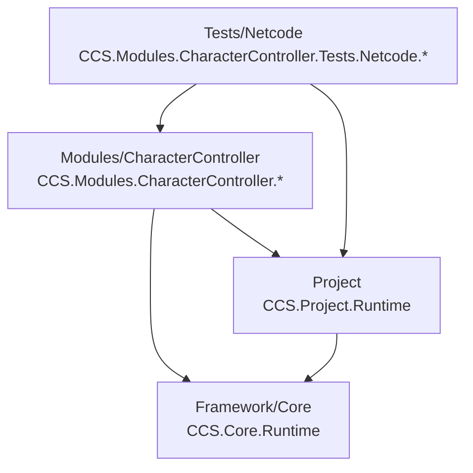

# CCS Survival — Folder Structure Reference

**Project:** CCS Survival  
**Version:** 0.5.4 — Interaction Pickup and Door Flow  
**Unity:** 6000.3.10f1 (Unity 6)  
**Author:** James Schilz  
**Date:** June 2026  
**Location:** `Assets/CCS/FOLDER_STRUCTURE.md`

This is the authoritative folder inventory for the **active** CCS Unity project. Paths are relative to the repository root unless noted.

---

## Table of Contents

1. [What Changed Recently](#what-changed-recently)
2. [Active Project Tree](#active-project-tree)
3. [Architecture at a Glance](#architecture-at-a-glance)
4. [Framework/](#framework)
5. [Modules/](#modules)
6. [Project/](#project)
7. [Surrounding Unity Folders](#surrounding-unity-folders)
8. [Dependency Rules](#dependency-rules)
9. [Quick Start Paths](#quick-start-paths)
10. [Related Documentation](#related-documentation)

---

## What Changed Recently

The Character Controller module now centers on **two test scenes** with **focused builder/validator tooling** — no legacy setup menus, scene generators, or auto-repair flows.

### Removed / Retired

| Removed | Reason |
|---------|--------|
| Placeholder gameplay modules (`Crafting`, `Equipment`, `Hotbar`, etc.) | No implementation yet |
| `Assets/CCS/Shared/` and `Assets/CCS/Tests/` (project root) | Empty scaffolds |
| Legacy Character Controller setup menus | Replaced by builder + validator pattern |
| `CCS_CharacterControllerTestSceneSetup` and old module-wide validate orchestration | Superseded by master test builder/validator |
| Netcode auto-repair / duplicate prefab validators / UI polish editors | Single setup + validate path for hosting |

### Kept / Added

| Item | Purpose |
|------|---------|
| `Assets/CCS/Framework/` | Core platform |
| `Assets/CCS/Project/` | Bootstrap, composition, docs |
| `Assets/CCS/Modules/CharacterController/` | Only active gameplay module |
| `Tests/Netcode/` | Local multiplayer test harness (Netcode for GameObjects) |
| `SCN_CCS_CharacterController_MasterTest` | Primary traversal / controller test scene |
| `SCN_CCS_MultiplayerHosting` | Host/join UI and NetworkManager scene |
| `Assets/DefaultNetworkPrefabs.asset` | Netcode default list (kept **empty**; test prefabs register via `CCS_TestNetworkPrefabsList`) |

**Policy going forward:** Do not recreate unused module folders ahead of implementation. Test scenes are source of truth; editor tooling verifies/repairs hierarchy and reports problems — it does not regenerate scenes.

---

## Active Project Tree

```text
Assets/CCS/
├── FOLDER_STRUCTURE.md                 # This document
│
├── Scenes/                             # Project-wide scenes
│   ├── Bootstrap/
│   ├── CharacterController/
│   └── Network/
│
├── Framework/                          # Reusable core platform (gameplay-free)
│   ├── Core/
│   │   ├── Runtime/                    # CCS.Core.Runtime
│   │   ├── Editor/                     # CCS.Core.Editor
│   │   └── Documentation/
│   ├── Documentation/
│   ├── Modules/                        # Reserved: framework-level pluggable assemblies
│   ├── Shared/                         # Reserved: framework-level reusable assets
│   └── Tests/                          # Reserved: framework test assemblies
│
├── Modules/
│   ├── README.md
│   └── CharacterController/            # Only active gameplay module
│       ├── Runtime/
│       ├── Editor/
│       │   ├── CCS_CharacterControllerMasterTestMenus.cs
│       │   └── Validation/             # Master test builder + validator
│       ├── Content/Input/
│       ├── Profiles/
│       ├── Materials/
│       │   ├── Environment/
│       │   ├── Player/
│       │   ├── Network/
│       │   └── UI/
│       ├── Prefabs/
│       │   ├── Player/
│       │   ├── Camera/
│       │   ├── Environment/
│       │   └── Network/
│       ├── Tests/
│       │   ├── Runtime/
│       │   ├── Editor/
│       │   └── Netcode/
│       │       ├── Editor/             # Hosting builder, validator, prefab setup
│       │       └── Runtime/            # Hosting menu, netcode player behaviour
│       └── Documentation/
│
└── Project/                            # Bootstrap and composition shell
    ├── Documentation/
    ├── Prefabs/
    └── Runtime/
```

There is **no** `Assets/CCS/Shared/` or `Assets/CCS/Tests/` at the project root.

---

## Architecture at a Glance



| Rule | Detail |
|------|--------|
| Dependency direction | **Modules → Project → Core** (never reversed) |
| Netcode test assembly | `Tests.Netcode.Runtime` → CharacterController.Runtime + Project + Netcode |
| Module registration | Manual installer order in `CCS_SurvivalInstaller` |
| Global state | No singleton managers or static service locators |
| Test scenes | Source of truth; builders verify/repair hierarchy only |
| Placeholders | Do not keep empty module folders for future features |

---

## Framework/

Reusable Crazy Carrot Studios platform code. Contains **no** survival-specific gameplay logic.

```text
Assets/CCS/Framework/
├── Core/           # Authoritative foundation
├── Documentation/  # Framework-wide script standards
├── Modules/        # Reserved (not the same as Assets/CCS/Modules/)
├── Shared/         # Reserved framework-level assets
└── Tests/          # Reserved framework test assemblies
```

> **Note:** `Framework/Shared/` and `Framework/Tests/` are upstream template scaffolds. They are **not** the removed project-level `Assets/CCS/Shared/` or `Assets/CCS/Tests/`.

### Core/Runtime — `CCS.Core.Runtime.asmdef`

| Subfolder | Purpose |
|-----------|---------|
| `Bootstrap/` | Core bootstrap contracts |
| `Data/` | `CCS_Result`, messages, error codes |
| `Diagnostics/` | Diagnostic report structs |
| `Logging/` | Logging utilities |
| `Modules/` | Registry, host, install plan, base classes, interfaces |
| `Services/` | `CCS_ServiceRegistry`, `CCS_IService` |
| `Systems/` | Bootstrap runner, events, runtime host, update loop |
| `SmokeTests/` | In-assembly smoke harness |
| `Utilities/` | Logging, validation helpers |
| `Prefabs/` | `PF_CCS_RuntimeHost.prefab` |
| `Scenes/` | `SCN_CCS_Bootstrap.unity` |

**Key runtime types:**
- `CCS_RuntimeHost` — instance-owned subsystem host
- `CCS_ModuleRegistry` / `CCS_ModuleHost` — module lifecycle
- `CCS_ServiceRegistry` — typed services (no globals)
- `CCS_EventDispatcher` — decoupled event bus
- `CCS_BootstrapRunner` — ordered bootstrap execution

### Core/Editor — `CCS.Core.Editor.asmdef`

Reserved editor folders: `Assembly/`, `Inspectors/`, `Menus/`, `Utilities/`, `Validators/`, `Windows/`.

### Core/Documentation/

Platform architecture, upstream workflow, release notes, and validation records.

---

## Modules/

Only **CharacterController**, **Attributes**, and **Interaction** exist as active gameplay modules.

See [Modules/README.md](Modules/README.md) for module creation rules.

### Standard layout (use when adding future modules)

```text
Assets/CCS/Modules/<Feature>/
├── Runtime/          # CCS.Modules.<Feature>.Runtime.asmdef
├── Editor/           # Validation and authoring tools
├── Content/          # Module-owned data
├── Prefabs/          # Module prefabs
├── Profiles/         # ScriptableObject configuration
├── Tests/            # Module test scenes and harness assets
└── Documentation/    # Module contract and integration notes
```

---

### Attributes/ — active (v0.3.0)

**Assemblies:**
- `CCS.Modules.Attributes.Runtime` / `.Editor`
- `CCS.Modules.Attributes.Tests.Runtime`

**Namespace:** `CCS.Modules.Attributes` (test types under `CCS.Modules.Attributes.Tests`)

**Menu:** `CCS/Attributes/Validate Attributes Module`

**Canonical assets:**
- `Tests/Profiles/CCS_AttributeDefinition_Health.asset`
- Test player wiring on `CharacterController/Tests/Prefabs/PF_CCS_CharacterController_TestPlayer_Networked.prefab`

**Doc:** [CCS_Attributes_Module.md](Modules/Attributes/Documentation/CCS_Attributes_Module.md)

---

### Interaction/ — active (v0.4.0)

**Assemblies:**
- `CCS.Modules.Interaction.Runtime` / `.Editor`

**Namespace:** `CCS.Modules.Interaction`

**Menu:** `CCS/Interaction/Validate Interaction Module`

**Canonical assets:**
- `Tests/Profiles/CCS_InteractionScannerProfile_Default.asset`
- `Tests/Prefabs/PF_CCS_TestInteractable_ToggleCube.prefab`
- Test player scanner on `CharacterController/Tests/Prefabs/PF_CCS_CharacterController_TestPlayer_Networked.prefab`

**Doc:** [CCS_Interaction_Module.md](Modules/Interaction/Documentation/CCS_Interaction_Module.md)

---

### CharacterController/ — active

**Assemblies:**
- `CCS.Modules.CharacterController.Runtime` / `.Editor`
- `CCS.Modules.CharacterController.Tests.Netcode.Runtime` / `.Editor`

**Namespace:** `CCS.Modules.CharacterController` (netcode test types under `CCS.Modules.CharacterController.Tests.Netcode`)

#### Runtime/

| Subfolder | Purpose |
|-----------|---------|
| `Components/` | Motor, camera, input provider, debug HUD |
| `Services/` | `CCS_CharacterControllerService` |
| `Profiles/` | Movement/camera ScriptableObject types |
| `Data/` | State, snapshot, mode enums |
| `Validation/` | Runtime asset/prefab validation helpers |
| `Utilities/` | `CCS_SingleAudioListenerUtility` |
| *(root)* | `CCS_CharacterControllerConstants.cs` |

**Key components:**
- `CCS_CharacterMotor` — profile-driven movement
- `CCS_CharacterCameraController` — Cinemachine third-person camera
- `CCS_CharacterInputActionProvider` — Input System binding
#### Editor/Validation/

Master test scene tooling only. **No** legacy setup or ground-creation menus.

| Script | Purpose |
|--------|---------|
| `CCS_CharacterControllerMasterTestLayoutConstants.cs` | Expected layout for master test scene |
| `CCS_CharacterControllerMasterTestBuilder.cs` | Verify/repair hierarchy (does not regenerate scene) |
| `CCS_CharacterControllerMasterTestValidator.cs` | Report-only validation |

#### Tests/Netcode/Editor/

Hosting and netcode asset wiring. Assigns **project prefab assets only**.

| Script | Purpose |
|--------|---------|
| `CCS_CharacterControllerTestHarnessMenus.cs` | Setup + validate menu registration |
| `CCS_NetcodeNetworkPrefabSetupUtility.cs` | Clears/rebuilds NetworkManager + prefab list assets |
| `CCS_MultiplayerHostingBuilder.cs` | Hosting scene hierarchy verify/repair |
| `CCS_MultiplayerHostingValidator.cs` | Report-only hosting + prefab validation |

**Editor menus:**

| Menu | Action |
|------|--------|
| `CCS/Character Controller/Scene/Setup And Validate Master Test Scene` | Master test builder + validate |
| `CCS/Character Controller/Scene/Setup And Validate Multiplayer Hosting Scene` | Hosting scene repair + UI rebuild + validate |

#### Tests/Netcode/Runtime/

| Script | Purpose |
|--------|---------|
| `CCS_MultiplayerHostingMenu.cs` | Host/join UI; validates config before StartHost/StartClient |
| `CCS_LocalMultiplayerTestLauncher.cs` | Connection approval, offline actor disable, spawn placement |
| `CCS_ControllerTestNetworkPlayerBehaviour.cs` | Owner/remote visuals, camera rig wiring |
| `CCS_NetworkPlayerNameplate.cs` | NetworkVariable display name |
| `CCS_MultiplayerTestSpawnUtility.cs` | Dedicated spawn points in master test scene |
| `CCS_NetcodeNetworkConfigValidationUtility.cs` | Runtime prefab reference guard |
| `CCS_NetcodeTestConstants.cs` | Shared paths and test constants |

#### Content/Input/

| Asset | Purpose |
|-------|---------|
| `CCS_CharacterController_InputActions.inputactions` | Module-owned Gameplay input map |

#### Profiles/

| Asset | Purpose |
|-------|---------|
| `Movement/CCS_CharacterMovementProfile_Default.asset` | Default movement tuning |
| `Camera/CCS_CharacterCameraProfile_ThirdPersonSurvival.asset` | Third-person camera profile |
| `Camera/CCS_DefaultCharacterCameraProfileSet.asset` | Active camera profile set |
| `TestPlayer/CCS_TestPlayerDisplayProfile_Default.asset` | Test player visual layout + profile references |

#### Prefabs/

| Path | Asset | Purpose |
|------|-------|---------|
| `Player/` | `PF_CCS_CharacterController_TestNPC.prefab` | Offline NPC route runner |
| `Camera/` | `PF_CCS_CharacterCameraRig.prefab` | Scene camera rig for master test |
| `Environment/` | `PF_CCS_TestGround_OneMeterGrid.prefab` | 200m × 200m grid ground |
| `Environment/` | `PF_CCS_TestBuilding_RoofPlatform.prefab` | 8m × 10m building with roof at Y=3 |
| `Environment/` | `PF_CCS_TestStairs_RoofAccess.prefab` | Rear stairs (12 steps) |
| `Environment/` | `PF_CCS_TestRamp_RoofAccess.prefab` | Front ramp (3m rise / 6m run) |
| `Environment/` | `PF_CCS_TestDoor_Single.prefab` | Door prop (nested in building) |
| `Network/` | `PF_CCS_TestNetworkManager.prefab` | NetworkManager + transport + launcher |
| `Network/` | `CCS_TestNetworkPrefabsList.asset` | One entry: networked player prefab |

#### Materials/

| Path | Purpose |
|------|---------|
| `Environment/` | Ground grid, brick, concrete, door wood, course default |
| `Player/` | Yellow, red, green, black test player materials |
| `Network/` | Reserved |
| `UI/` | Reserved |

#### Scenes/ (project-wide)

| Path | Scene | Purpose |
|------|-------|---------|
| `Assets/CCS/Scenes/Bootstrap/` | `SCN_CCS_Survival_Bootstrap.unity` | Project bootstrap entry |
| `Assets/CCS/Scenes/CharacterController/` | `SCN_CCS_CharacterController_MasterTest.unity` | **Primary** controller + traversal test scene |
| `Assets/CCS/Scenes/CharacterController/` | `SCN_CCS_CharacterController_Test.unity` | Legacy ground-only test scene |
| `Assets/CCS/Scenes/Network/` | `SCN_CCS_MultiplayerHosting.unity` | Host/join UI; contains `PF_CCS_TestNetworkManager` instance |

**Master test scene layout (source of truth):**

```text
PF_CCS_Survival_BootstrapRoot
Environment/
├── PF_CCS_TestGround_OneMeterGrid
├── PF_CCS_TestBuilding_RoofPlatform
│   └── PF_CCS_TestDoor_Single
├── PF_CCS_TestStairs_RoofAccess
└── PF_CCS_TestRamp_RoofAccess

TestPoints/
├── TP_Spawn_Host / TP_Spawn_Client_01 / TP_Spawn_Client_02
├── Traversal markers (stairs, roof, ramp, door, cover, loop complete)

Tests/Prefabs/PF_CCS_CharacterController_TestPlayer_Networked
PF_CCS_CharacterCameraRig
PF_CCS_CharacterController_TestNPC
Directional Light
```

Course origin: world `(30, 0, 30)`. Ground grid at world origin `(0, 0, 0)`.

#### Tests/

Test **scripts** only — scenes and prefabs live under `Assets/CCS/Scenes/` and `Prefabs/` above.

| Path | Purpose |
|------|---------|
| `Tests/Prefabs/` | Canonical network-capable test player prefab |
| `Tests/Runtime/` | Solo spawn, offline bootstrap, session events, join feed UI |
| `Tests/Editor/` | Offline test editor helpers |
| `Tests/Netcode/Runtime/` | Hosting menu, netcode player behaviour |
| `Tests/Netcode/Editor/` | Hosting builder, validator, prefab setup menus |

**Netcode flow:** Play hosting scene → enter name → host/join → load master test scene additively.

#### Documentation/

| Document | Purpose |
|----------|---------|
| `CCS_CharacterController_Module.md` | Full module reference |

---

## Project/

Composition shell — bootstrap, install sequencing, validation contracts, and project docs. Does **not** own feature gameplay implementations.

See [Project/README.md](Project/README.md).

```text
Assets/CCS/Project/
├── Documentation/    # Active architecture and standards
├── Prefabs/          # Bootstrap composition prefab
├── Runtime/          # CCS.Project.Runtime
└── Scenes/           # Project entry scene
```

### Runtime/ — `CCS.Project.Runtime.asmdef`

References `CCS.Core.Runtime` only. Namespace: `CCS.Project`.

| Subfolder | Purpose |
|-----------|---------|
| `Bootstrap/` | `CCS_SurvivalBootstrap` entry point |
| `Installers/` | `CCS_SurvivalInstaller` module install order |
| `Context/` | `CCS_SurvivalRuntimeContext` |
| `Diagnostics/` | Project-level diagnostics |
| `Foundation/` | Module base, profiles, scene rules, validation framework |
| `Character/` | Authority, avatar, identity contracts (transitional skeleton) |

> **Transitional:** Some character skeleton code still lives under `Project/Runtime/Character/` until fully moved into module assemblies.

### Scenes & Prefabs

| Asset | Path |
|-------|------|
| Entry scene | `Scenes/SCN_CCS_Survival_Bootstrap.unity` |
| Bootstrap root | `Prefabs/PF_CCS_Survival_BootstrapRoot.prefab` |

### Documentation/

| Document | Topic |
|----------|-------|
| `Survival_Framework_Architecture_Gate.md` | Ownership boundaries and audit rules |
| `Survival_Runtime_Foundation.md` | Module base classes and installer hierarchy |
| `Survival_Validation_Standards.md` | ID rules and save-safe identity |
| `Survival_Scene_Bootstrap_Standards.md` | Composition root and scene validation |
| `CCS_Versioning_Policy.md` | Version map and tagging rules |

Full index: [Project/Documentation/README.md](Project/Documentation/README.md)

---

## Surrounding Unity Folders

These sit outside `Assets/CCS/` but are part of the active project.

### Assets/ (project-level netcode)

| Asset | Purpose |
|-------|---------|
| `DefaultNetworkPrefabs.asset` | Netcode default prefab list — **must stay empty** for this project |

### Assets/Settings/

| Asset | Purpose |
|-------|---------|
| `Input/InputSystem_Actions.inputactions` | Project-level Input System actions |
| `DefaultVolumeProfile.asset` | URP post-processing defaults |
| `Mobile_RPAsset.asset` / `Mobile_Renderer.asset` | Mobile URP config |
| `PC_RPAsset.asset` / `PC_Renderer.asset` | PC URP config |
| `UniversalRenderPipelineGlobalSettings.asset` | URP global settings |

### Packages/ (required)

| Package | Version (approx.) | Purpose |
|---------|-------------------|---------|
| `com.unity.render-pipelines.universal` | 17.3.0 | URP |
| `com.unity.inputsystem` | 1.18.0 | Input System |
| `com.unity.cinemachine` | 3.1.2 | Third-person camera |
| `com.unity.netcode.gameobjects` | 2.4.4 | Multiplayer test harness |
| `com.unity.transport` | 2.5.2 | UTP transport |
| `com.unity.ai.navigation` | 2.0.12 | Navigation |
| `com.unity.test-framework` | 1.6.0 | Testing |

### ProjectSettings/

Standard Unity configuration. Entry scene: `Assets/CCS/Scenes/Bootstrap/SCN_CCS_Survival_Bootstrap.unity`

### Documentation/ (repo root)

Repo-level direction docs. Active architecture lives in `Assets/CCS/Project/Documentation/`.

### Generated locally (not in Git)

`Library/`, `Temp/`, `Logs/`, `UserSettings/`, `Builds/`, `BuildLogs/`

---

## Dependency Rules

| From | May reference | Must not reference |
|------|---------------|-------------------|
| `CCS.Core.Runtime` | Unity, self | Project, Modules, gameplay |
| `CCS.Project.Runtime` | Core | Individual module internals |
| `CCS.Modules.CharacterController.Runtime` | Core, Project | Other modules directly |
| `CCS.Modules.CharacterController.Tests.Netcode.Runtime` | Core, Project, CharacterController.Runtime, Netcode | Production lobby/account services |

**Save-stable identity prefixes:**
- Module: `ccs.survival.`
- Profile: `ccs.survival.profile.`
- Authority: `ccs.survival.authority.`
- Avatar: `ccs.survival.avatar.`

Centralized validation: `CCS_SurvivalIdentityUtility` in Project.

---

## Quick Start Paths

| Task | Path |
|------|------|
| Develop from bootstrap | `Assets/CCS/Scenes/Bootstrap/SCN_CCS_Survival_Bootstrap.unity` |
| Open master controller test | `Assets/CCS/Scenes/CharacterController/SCN_CCS_CharacterController_MasterTest.unity` |
| Open multiplayer hosting | `Assets/CCS/Scenes/Network/SCN_CCS_MultiplayerHosting.unity` |
| Canonical test player | `Assets/CCS/Modules/CharacterController/Tests/Prefabs/PF_CCS_CharacterController_TestPlayer_Networked.prefab` |
| Network manager prefab | `Assets/CCS/Modules/CharacterController/Prefabs/Network/PF_CCS_TestNetworkManager.prefab` |
| Test ground prefab | `Assets/CCS/Modules/CharacterController/Prefabs/Environment/PF_CCS_TestGround_OneMeterGrid.prefab` |
| Setup + validate master test | Menu: `CCS/Character Controller/Scene/Setup And Validate Master Test Scene` |
| Setup + validate hosting | Menu: `CCS/Character Controller/Scene/Setup And Validate Multiplayer Hosting Scene` |
| Core smoke test scene | `Assets/CCS/Framework/Core/Runtime/Scenes/SCN_CCS_Bootstrap.unity` |
| Architecture rules | `Assets/CCS/Project/Documentation/Survival_Framework_Architecture_Gate.md` |

---

## Related Documentation

- [Repository README](../../README.md)
- [Modules README](Modules/README.md)
- [Project README](Project/README.md)
- [Framework Core README](Framework/Core/README.md)
- [Character Controller Module](Modules/CharacterController/Documentation/CCS_CharacterController_Module.md)

---

## Active Module Summary

| Module | Status |
|--------|--------|
| **CharacterController** | Movement, camera, input, master test scene, local netcode harness, builder/validator tooling |

No other gameplay modules exist. Create the next module only when implementation begins.
