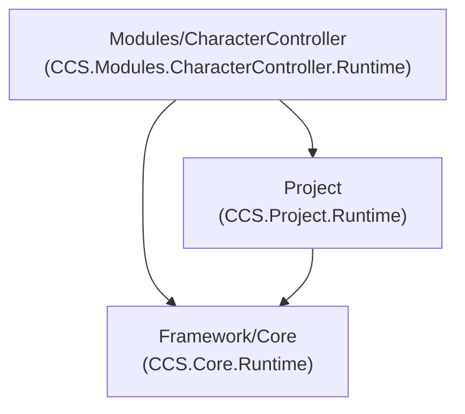

# CCS Survival — Folder Structure Reference

**Project:** CCS Survival  
**Version:** 0.2.1 — Character Controller Test Ground  
**Unity:** 6000.3.10f1 (Unity 6)  
**Author:** James Schilz  
**Date:** June 18, 2026  
**Location:** `Assets/CCS/FOLDER_STRUCTURE.md`

This document describes the **active** CCS Unity project folder structure after the v0.2.1 cleanup. Paths are relative to the repository root unless noted.

---

## High-Level Overview

All first-party code and content lives under **`Assets/CCS/`**:

```text
Assets/CCS/
├── Framework/                  # Reusable core platform (gameplay-free)
├── Modules/
│   └── CharacterController/    # Only active gameplay module
├── Project/                    # Bootstrap, composition, scenes, docs
└── FOLDER_STRUCTURE.md         # This document
```

**Active scope:**
- CCS Framework
- Project bootstrap/composition
- CharacterController module
- CharacterController test ground prefab/scene/material
- Required Unity settings and packages

**Not kept as placeholders:** unused module folders, empty `Shared/`, empty project `Tests/`. Create those when something actually needs them.

---

## Architecture at a Glance



**Key rules:**
- Dependency direction: **Modules → Project → Core**
- Manual module installer registration
- No placeholder module folders for future features
- Each new module must ship runtime, test asset, validation, and docs before moving on

---

## Framework/

Reusable core platform. No survival-specific gameplay logic.

```text
Assets/CCS/Framework/
├── Core/           # Runtime + Editor foundation (CCS.Core.*)
├── Documentation/  # Script standards and stability notes
├── Modules/        # Reserved for future framework-level pluggable assemblies
├── Shared/         # Framework-level reusable assets (not game-specific)
└── Tests/          # Reserved for future framework test assemblies
```

### Core/Runtime highlights

| Area | Purpose |
|------|---------|
| `Modules/` | Module registry, host, install plan, lifecycle |
| `Services/` | Typed service registry |
| `Systems/` | Bootstrap runner, event dispatcher, runtime host, update loop |
| `SmokeTests/` | In-assembly smoke test harness |
| `Scenes/` | `SCN_CCS_Bootstrap.unity` core validation scene |
| `Prefabs/` | `PF_CCS_RuntimeHost.prefab` |

---

## Modules/

### CharacterController/ — active module

```text
Assets/CCS/Modules/CharacterController/
├── Runtime/          # Motor, camera, input, service, validation
├── Editor/           # Long-term validation only
├── Content/Input/    # Module-owned Input Actions
├── Profiles/         # Movement and camera ScriptableObjects
├── Prefabs/          # PF_CCS_CharacterController_TestPlayer.prefab
├── Tests/
│   ├── Prefabs/      # PF_CCS_TestGround_OneMeterGrid.prefab
│   ├── Materials/    # Grid material + texture
│   └── Scenes/       # SCN_CCS_CharacterController_Test.unity
└── Documentation/
```

**Validation menu:** `CCS/Project/Validation/Validate Character Controller`

---

## Project/

Bootstrap and composition shell.

```text
Assets/CCS/Project/
├── Documentation/    # Architecture and standards
├── Prefabs/          # PF_CCS_Survival_BootstrapRoot.prefab
├── Runtime/          # CCS.Project.Runtime
└── Scenes/           # SCN_CCS_Survival_Bootstrap.unity
```

**Entry scene:** `Assets/CCS/Project/Scenes/SCN_CCS_Survival_Bootstrap.unity`

---

## Surrounding Unity Folders

| Folder | Purpose |
|--------|---------|
| `Assets/Settings/` | URP assets, volume profiles, Input System actions |
| `Packages/` | UPM manifest (URP, Input System, Cinemachine, etc.) |
| `ProjectSettings/` | Unity editor/player configuration |
| `Documentation/` | Repo-level architecture direction docs |

### Generated locally (not in Git)

`Library/`, `Temp/`, `Logs/`, `UserSettings/`, `Builds/`, `BuildLogs/`

---

## Active Module Summary

| Module | Status |
|--------|--------|
| **CharacterController** | **Active** — movement, camera, input, test player prefab, test ground prefab/scene, validation |

No other gameplay modules exist yet.

---

## Quick Start Paths

| Task | Path |
|------|------|
| Develop from bootstrap | `Assets/CCS/Project/Scenes/SCN_CCS_Survival_Bootstrap.unity` |
| Open test ground scene | `Assets/CCS/Modules/CharacterController/Tests/Scenes/SCN_CCS_CharacterController_Test.unity` |
| Test player prefab | `Assets/CCS/Modules/CharacterController/Prefabs/PF_CCS_CharacterController_TestPlayer.prefab` |
| Test ground prefab | `Assets/CCS/Modules/CharacterController/Tests/Prefabs/PF_CCS_TestGround_OneMeterGrid.prefab` |
| Ground material | `Assets/CCS/Modules/CharacterController/Tests/Materials/M_CCS_TestGround_1mGrid.mat` |
| Architecture rules | `Assets/CCS/Project/Documentation/Survival_Framework_Architecture_Gate.md` |
| Add a future module | `Assets/CCS/Project/Documentation/Future_Gameplay_Module_Guidelines.md` |

---

## Related Documentation

- [Repository README](../../README.md)
- [Modules README](Modules/README.md)
- [Project README](Project/README.md)
- [Character Controller Module](Modules/CharacterController/Documentation/CCS_CharacterController_Module.md)
